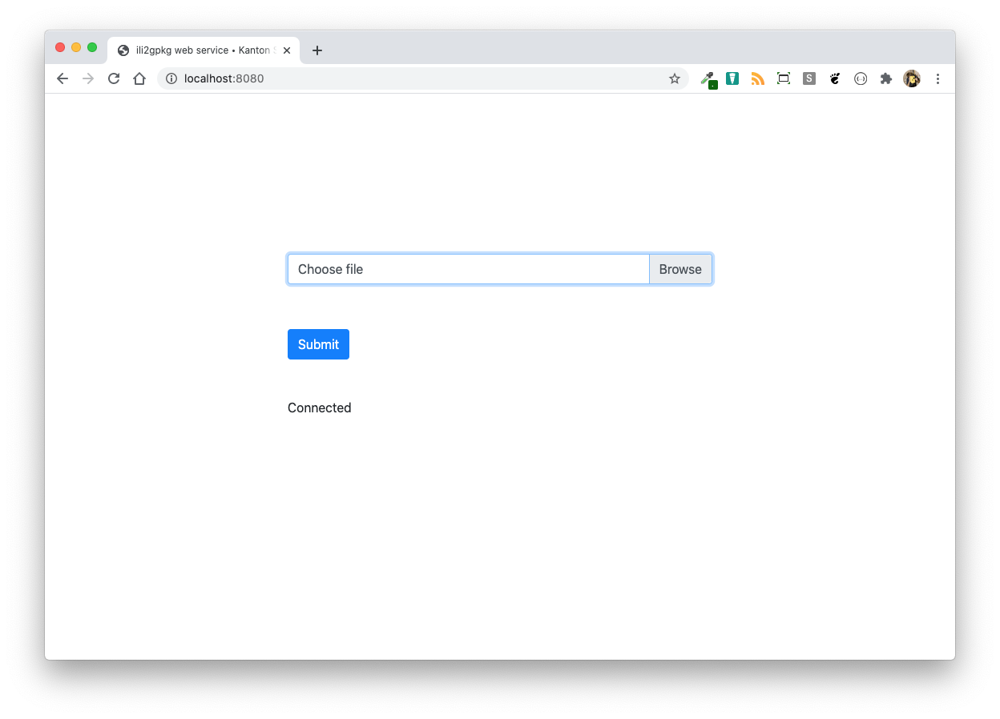
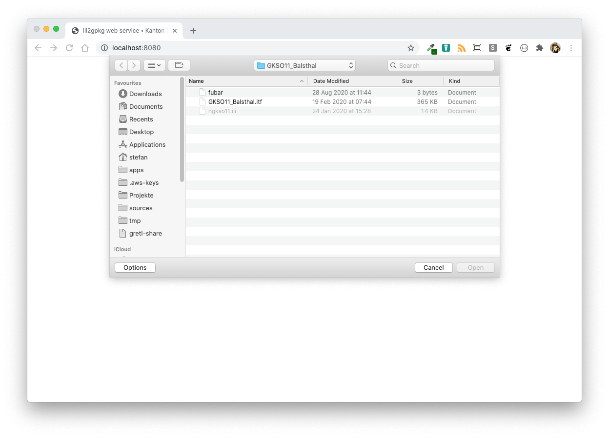
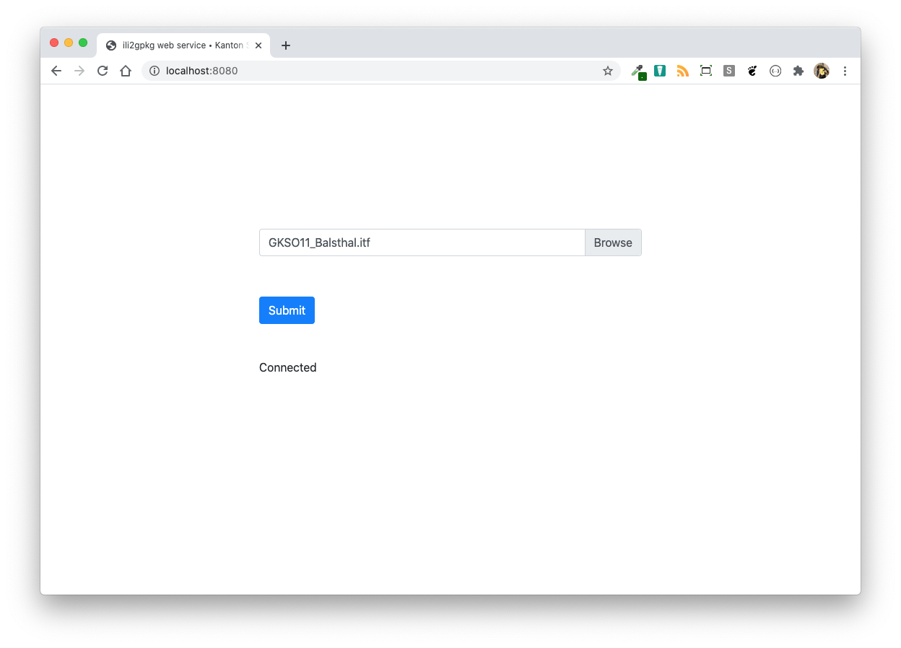
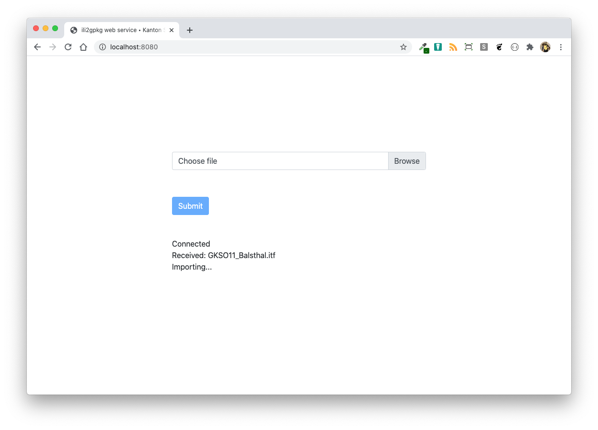
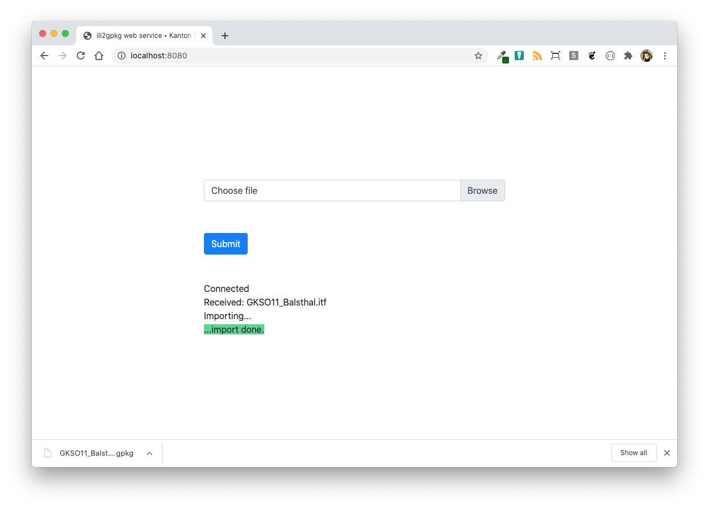
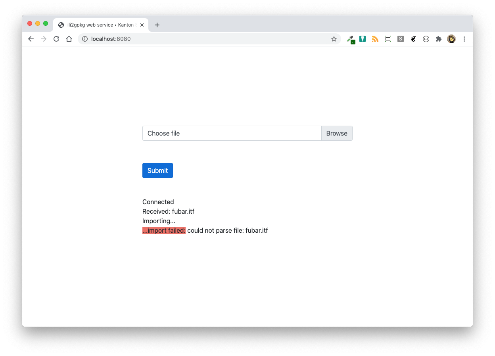
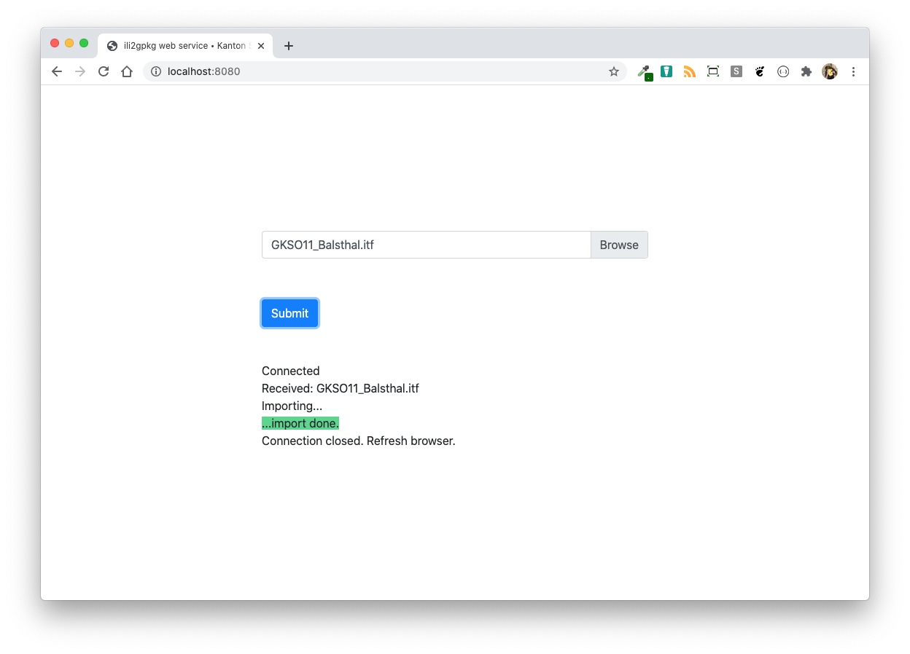

# Benutzerhandbuch

## Bedienung des Webservices

Der *ili2gpkg web service* stellt eine einfache Art dar INTERLIS-Daten in eine GeoPackage-Datei umzuwandeln. Es gibt keine Möglichkeit die Umwandlung mittels Parametern und Optionen zu steuern, sondern es werden für die meisten Fälle sinnvolle Standardwerte verwendet. Die GeoPackage-Datei wird nach erfolgreicher Umwandlung direkt heruntergeladen.

**Achtung**: Die INTERLIS-Transferdatei wird während der Umwandlung nicht validiert. Für diesen Arbeitsschritt ist der [_ilivalidator web service_](https://geo.so.ch/ilivalidator) oder die Software [_ilivalidator_](https://github.com/claeis/ilivalidator) zur verwenden.

Beim Aufruf des *ili2gpkg web services* erscheint folgendes Webformular:

Im Browserfenster unter dem "Submit"-Knopf muss zwingend "Connected" stehen. 

Die zu transformierende Datei kann durch Knopfdruck auf "Browse" ausgewählt werden. Die Datei darf *nicht* gezippt sein und höchstens 50 Megabyte gross sein.

Im Feld "Choose file" erscheint neu der Name der ausgewählten Datei.

Die Umwandlung kann durch Knopfdruck auf "Submit" gestartet werden. Der Knopf wird ausgegraut und es können keine weiteren Aktionen auf der Webseite vorgenommen werden. Im Browserfenster erscheinen die meldungen "Received: <Dateiname>" und "Validating...". 

Die Umwandlung kann - je nach Grösse der Datei resp. des Dateiinhaltes - ein paar Sekunden bis zu einigen Minuten dauern. Nach der erfolgreichen Umwandlung wird die Datei direkt heruntergeladen und es erscheint im Browser die Meldung "...import done":

Konnte die Transformation nicht durchgeführt werden, ist die Meldung "...import failed" gefolgt von einer Fehlermeldung.

Unter gewissen Umständen kann es zu Unterbrüchen zwischen Browser und Server kommen. In diesem Fall erscheint bei einer Aktion (z.B. "Submit"-Knopf drücken) die Meldung "Connection closed. Refresh Browser". In diesem Fall muss die Seite neu geladen werden und es sollte wieder die Melung "Connected" erscheinen.

